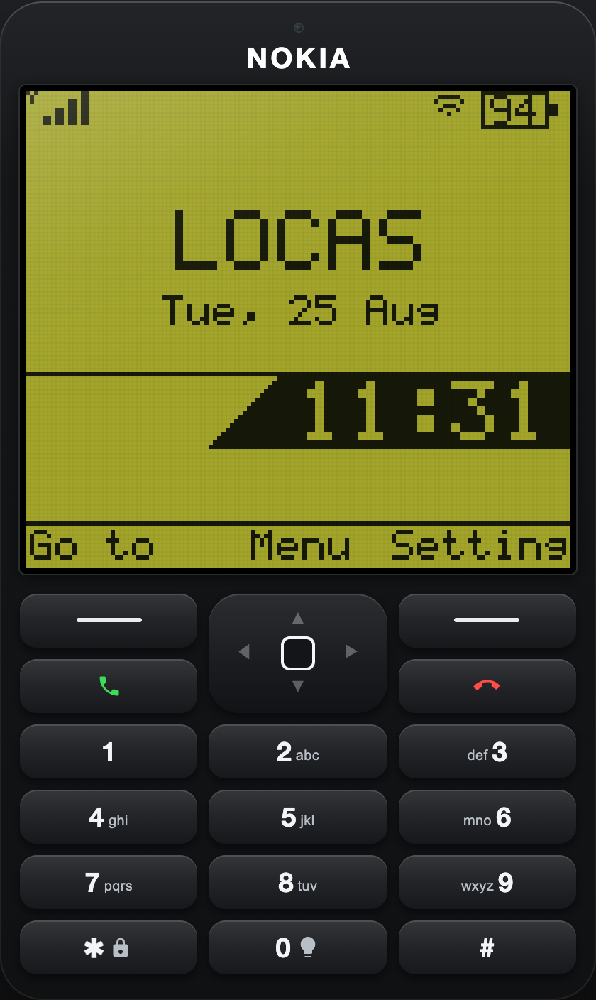

# Nokia Launcher

Nokia 1280 的網頁版模擬器。單一 HTML 檔、零依賴、可離線執行。

**線上版：https://benny19930812.github.io/Nokia-launcher/**



## 這是什麼

把 2010 年那支經典功能機 Nokia 1280 的介面完整重現在網頁上：128×112 的單色 LCD、多次點按輸入法、Snake、開機鈴聲，連長按紅鍵關機都在。

## 怎麼做的

**不是用 CSS 假裝點陣**，而是真的模擬一塊單色 LCD：

1. 所有畫面先繪製到一張離屏 `<canvas>`，解析度就是真機的 **128×112**
2. 逐像素計算亮度並二值化——低於門檻的變成墨色、其餘變成背光底色，得到真正的 1-bit 畫面
3. 放大整數倍輸出，搭配 `image-rendering: pixelated`，再疊一層 CSS 像素格線

字型是**內建的 5×7 點陣字型**，涵蓋完整 ASCII 32–126（98 個字），每個字直接寫成 7 列 × 5 欄的 0/1：

```js
'A:01110:10001:10001:11111:10001:10001:10001',
'S:01111:10000:10000:01110:00001:00001:11110',
```

繪製時照著 bitmap 填 `fillRect`，完全不經過瀏覽器的字型引擎。這一點是關鍵：先前試過用系統 monospace 在 8px 繪製再二值化，字型微調（hinting）會把筆畫壓成半透明灰階，砍成 1-bit 之後就變成殘缺的碎塊，完全無法閱讀。自己定義每個點才能保證筆畫落在像素格上。

選單反白、以及首頁那條黑底白字的斜切時間帶，都是用 `globalCompositeOperation = 'difference'` 做 XOR 畫出來的——先填黑色多邊形，再用 XOR 疊上時間，黑底自然反成白字。音效是 Web Audio 的單音方波。

## 功能

| 功能 | 說明 |
|---|---|
| 開機 | NOKIA 握手動畫 + 開機鈴聲 |
| 待機 | 訊號格／電量／電信商／時鐘，按數字直接進撥號 |
| Messages | 收件匣、閱讀、**多次點按輸入法**（2→a,b,c,2，850ms 逾時，`#` 切換 Abc/abc/ABC/123） |
| Contacts / Call log | 清單、詳細資料、通話計時 |
| Games | Snake，會隨分數加速，最高分存 localStorage |
| Clock / Calculator / Torch | `*` 循環運算子、`#` 小數點 |
| Settings | 5 種背光主題、電信商名稱、音效開關、機身縮放，設定存 localStorage |

## 操作

滑鼠點擊機身上的按鍵，或用實體鍵盤：

| 按鍵 | 功能 |
|---|---|
| `↑` `↓` `←` `→` | 導覽 |
| `Enter` | OK / 選擇 |
| `Backspace` | 清除 / 返回 |
| `Z` `X` | 左 / 右軟鍵 |
| `C` `E` | 通話 / 結束鍵 |
| `0-9` `*` `#` | 數字鍵（多次點按輸入文字） |

長按紅色結束鍵約 1 秒關機，關機後按任意鍵開機。

## 在手機上使用

版面是流體的，機身會依螢幕寬度縮放。點陣圖解析度由「實際顯示尺寸 × 裝置像素比」反推，讓每個 LCD 像素剛好落在整數個裝置像素上，在 Retina 螢幕上才不會出現寬窄不一的鋸齒。

手機上機身會**滿版填滿視窗**（上下不留白、不捲動），螢幕與鍵盤依比例分配剩餘高度，鍵盤六排剛好填滿下半部。

iPhone 用 Safari 開啟後，點分享鈕 →「加入主畫面」，就會以獨立視窗全螢幕執行（`display: standalone`），沒有網址列，圖示是同一套點陣字畫出來的 Nokia 螢幕。

## 授權

MIT。開機鈴聲取自 Francisco Tárrega 的《Gran Vals》（1902，公有領域）。
